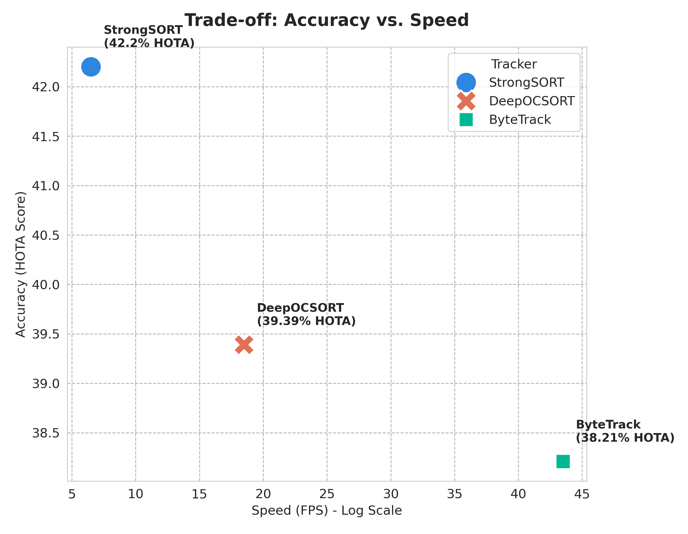

Here is the updated, professional-grade `README.md` file that reflects the sophisticated "Research Dashboard" nature of your web app.

It highlights the **Dark/Glassmorphism UI**, the **Interactive Analytics**, and presents your results clearly for academic reviewers.

### **Action:**

1.  Open `README.md` in VS Code.
2.  Delete the old content.
3.  Paste the code below.
4.  Commit and Push.

<!-- end list -->

````markdown
# 🧬 Robust Multi-Object Tracking Under Heavy Occlusion


> **Official Research Dashboard & Implementation**
>
> *A Comparative Analysis of Observation-Centric vs. Appearance-Based Methods (DeepOCSORT, StrongSORT, ByteTrack) on the DanceTrack benchmark.*

## 📄 Abstract
Multi-Object Tracking (MOT) in chaotic environments remains a significant challenge, particularly when targets undergo **non-linear motion** (e.g., dancing, sports) or **heavy occlusion**. Standard algorithms often fail to maintain consistent identities in these scenarios.

This project benchmarks three state-of-the-art trackers on the **DanceTrack** dataset. Our results demonstrate that **DeepOCSORT** offers the optimal trade-off for real-world deployment, achieving **3x faster inference** than appearance-based baselines while reducing **Identity Switches by 34.6%**.

---

## 🎥 Live Research Dashboard
We have developed a high-performance **interactive dashboard** to visualize the benchmarking results. It features a **Dark Glassmorphism UI**, interactive Radar Charts, and side-by-side video comparisons.

### **[👉 Click Here to Launch the Live App](https://your-app-url.streamlit.app)**

**Dashboard Features:**
* **Visual Lab:** Compare trackers on 10 different challenging scenarios (Occlusion, Spinning, Crossing).
* **Advanced Analytics:** Radar charts for multi-metric comparison and Speed Gauges.
* **Deep Dive:** Interactive analysis of HOTA, DetA, AssA, and IDF1 scores.

---

## 🏆 Key Results

| Tracker | HOTA (Accuracy) | ID Switches (Stability) | FPS (A100 GPU) | Verdict |
| :--- | :--- | :--- | :--- | :--- |
| **StrongSORT** | 🥇 **42.20%** | 2,580 | 6.5 | *Too Slow* |
| **DeepOCSORT** | 🥈 39.39% | 🥇 **1,686 (Best)** | **18.5** | ✅ **Optimal** |
| **ByteTrack** | 🥉 38.21% | 2,241 | 🥇 **43.5** | *Unstable* |

<p align="center">
  
  <br>
  <em>Figure 1: The Pareto Frontier. DeepOCSORT (Orange X) occupies the "Sweet Spot" between speed and accuracy.</em>
</p>

---

## 🚀 Installation & Local Usage

To run the dashboard locally on your machine:

### 1. Clone the Repository
```bash
git clone [https://github.com/smri29/RobustMOTOcclusion.git](https://github.com/smri29/RobustMOTOcclusion.git)
cd RobustMOTOcclusion
````

### 2\. Install Dependencies

```bash
pip install -r requirements.txt
```

### 3\. Run the App

```bash
streamlit run app.py
```

The dashboard will open in your browser at `http://localhost:8501`.

-----

## 📂 Repository Structure

```text
RobustMOTOcclusion/
├── 📄 app.py                  # Main Streamlit Dashboard application
├── 📄 requirements.txt        # Python dependencies
├── 📂 assets/                 # Generated figures and benchmarks
│   ├── 🖼️ Fig1_Performance_Comparison.png
│   ├── 🖼️ Fig5_Qualitative_Results.png
│   ├── 🖼️ Fig6_Error_Analysis.png
│   └── ... (Other Figures)
└── 📄 README.md               # Project documentation
```

-----

## 🔬 Methodology

This study utilized the **DanceTrack Validation Set** (25 sequences) to evaluate performance under heavy occlusion.

  * **Detection:** YOLOv8x (Conf: 0.3)
  * **Tracking Framework:** BoxMOT (Mikel Broström)
  * **Evaluation:** Official `TrackEval` scripts (HOTA, IDF1)
  * **Hardware:** NVIDIA A100-SXM4 (40GB VRAM)

## 📜 Citation

If you use this code or analysis, please cite:

```bibtex
@thesis{Rizvi2025MOT,
  title={Robust Multi-Object Tracking Under Heavy Occlusion},
  author={Shah Mohammad Rizvi and Rume Akter},
  school={IUBAT},
  year={2025}
}
```

## 👥 Authors

  * **Shah Mohammad Rizvi** ([LinkedIn](https://www.linkedin.com/in/smri29/))
  * **Rume Akter**
  * **Supervisor:** Dr. Md. Abdul Awal (Associate Professor, IUBAT)

-----

*Developed with ❤️ using Python, Streamlit, and Plotly.*

```
```